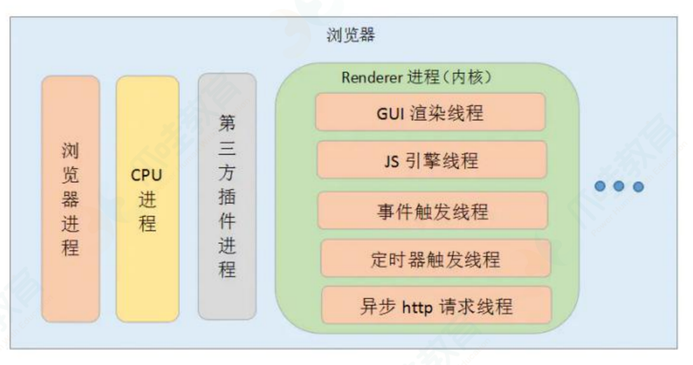
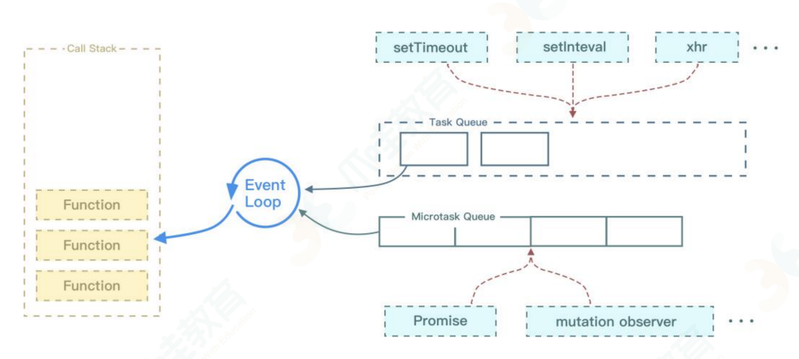
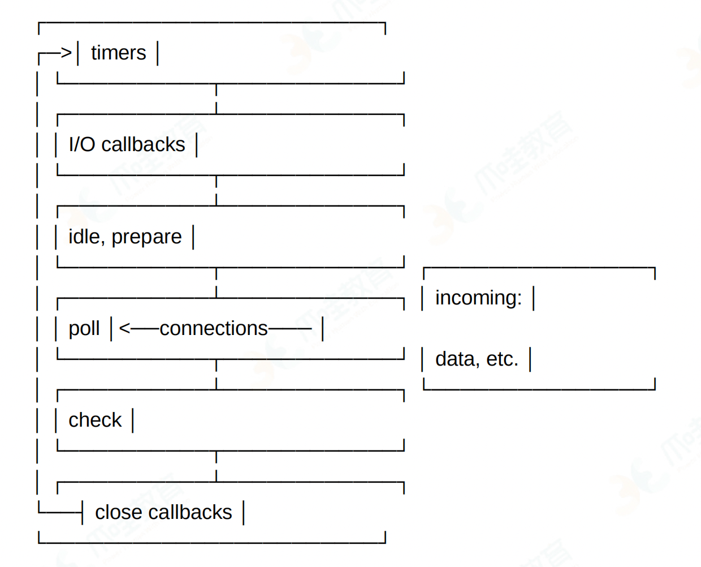

# 浏览器


### 浏览器内核

- Trident：IE浏览器的内核，对W3C标准支持的不好，且存在较多安全问题
- Webkit：Safari 采用的内核，优点是浏览速度较快，缺点是兼容性较低
- Blink：谷歌、Edge、Opera、Safari使用，是Webkit的一个分支
- Gecko：火狐和 Flock 使用，优点是功能强大、丰富，支持很多复杂网页效果和浏览器扩展接口，缺点就是消耗很多资源，比如内存
- Presto：Opera早期自用，优点是速度快，缺点是因为速度丢失了一部分网页兼容性

<br/>

### 从输入url到页面展示的过程

1. 输入url网址，浏览器判断是访问站点，还是拼接字符串调用默认搜索引擎
2. 如果要访问的url注册了Service Worker，那么会拦截所有请求，根据是否过期判断是否需要发送请求，如果需要就下一步
3. 查询强制缓存，有且未过期直接使用，有但过期，就发起请求，准备协商缓存
4. DNS域名解析：要把域名解析为IP地址，会从浏览器缓存、本地磁盘hosts文件、路由器缓存、ISP缓存等查找，如果都没有会发起DNS解析请求，直接找到IP
5. 通过IP向服务器发起TCP连接，三次握手；如果是https协议，则要先进行SSL协商，进行加密信息交换
6. 发送请求到服务器，服务器接受请求后，根据请求信息进行相应处理，并返回状态码和响应内容
7. 浏览器接收到响应内容后，会判断响应码，分析响应数据，然后进行后续处理：页面渲染、运行js脚本等
8. 页面解析及渲染
   1. 解析html文件，创建dom树
   2. 解析css，形成cssom
   3. 将dom树与cssom合并，构建渲染树
   4. 布局渲染树，也叫重排/回流（reflow）
   5. 绘制渲染树，也叫重绘（repaint）
9. 页面加载完毕

<br/>

### 浏览器解析渲染页面的过程

浏览器一边解析一边渲染。

1. 解析html文件，构建dom树，它由 dom 元素及属性节点组成
2. 解析css，生成cssom树
3. 将dom树与cssom树合并，构建渲染树，这个过程被叫做Attachment。渲染树的节点被称为渲染对象，渲染对象是一个包含有颜色、大小等属性的矩形，渲染对象和 dom 元素相对应。
4. 根据渲染树生成布局（回流），弄清楚各个节点在页面中的准确位置和大小，也被称为“自动重排”
5. 遍历渲染树并调用渲染对象的 paint 方法，将它们的内容显示有屏幕上

注意：这个过程是逐步完成的，为了更好的用户体验，渲染引擎将会尽可能早的将内容呈现到屏幕上，并不会等到所有的 html 都解析完 成之后再去构建和布局 render 树。它是解析完一部分内容就显示一部分内容，同时，可能还在通过网络下载其余内容。

<br/>

### 关键路径渲染

关键路径渲染（Critical Rendering Path）是指浏览器从获取 HTML、CSS 和 JavaScript 等资源，到解析这些资源，生成 DOM、CSSOM，再到构建渲染树，最后进行布局和绘制，完成页面的首次渲染的一系列过程。

关键路径渲染的主要步骤包括：

1. **获取资源**：浏览器首先通过 HTTP 或 HTTPS 协议，从服务器获取 HTML、CSS 和 JavaScript 等资源。

2. **构建 DOM**：浏览器解析 HTML 文档，生成 DOM 树。

3. **构建 CSSOM**：浏览器解析 CSS 样式，生成 CSSOM 树。

4. **生成渲染树**：浏览器将 DOM 树和 CSSOM 树合并，生成渲染树。渲染树只包含需要显示在页面上的节点。

5. **布局**：浏览器根据渲染树计算出每个节点在页面上的位置和大小，这个过程也被称为重排。

6. **绘制**：浏览器根据渲染树和布局信息，将每个节点绘制到屏幕上，这个过程也被称为重绘。

优化关键路径渲染的目标是尽快完成首次渲染，使用户能够尽快看到页面内容。这通常可以通过以下方式来实现：

- **减少资源数量和大小**：减少 HTTP 请求的数量，压缩和优化资源，可以减少获取资源的时间。

- **优化 CSS 和 JavaScript 的加载和执行**：CSS 是阻塞渲染的，因此应该尽快加载和解析。JavaScript 既可以阻塞 DOM 的构建，也可以阻塞 CSSOM 的构建，因此应该尽可能地推迟加载和执行。

- **利用浏览器缓存**：通过合理设置 HTTP 缓存头，可以避免重复获取资源。

- **优化图片加载**：对于大图片，可以使用懒加载的方式，等到需要显示时再加载。对于小图片，可以使用 CSS Sprites 或 Data URI 的方式，减少 HTTP 请求的数量。

- **使用 CDN**：使用内容分发网络（CDN）可以减少资源获取的延迟。

- **使用预加载和预渲染**：预加载可以提前获取将来可能需要的资源，预渲染可以提前渲染将来可能会访问的页面。

<br/>

### 渲染过程中遇到 js 文件如何处理

JavaScript 的加载、解析与执行会阻塞文档的解析，也就是说，在构建 DOM 时，HTML 解析器若遇到了 JavaScript，那么它会暂停文 档的解析，将控制权移交给 JavaScript 引擎，等 JavaScript 引擎运行完毕，浏览器再从中断的地方恢复继续解析文档。也就是说，如果想要首屏渲染的越快，就越不应该在首屏就加载 JS 文件，这也是都建议将 script 标签放在 body 标签底部的原因。当然在当下，并不是说 script 标签必须放在底部，因为你可以给 script 标签添加 defer 或者 async 属性。

<br/>

### js脚本延迟加载的方式

- 给脚本添加defer属性，让脚本与文档同步解析，然后文档解析完后再执行脚本
- 给脚本添加async属性，让脚本异步加载，不阻塞页面的解析，脚本加载完成后立即执行脚本，这时如果文档没有解析完会阻塞。
- 动态创建script标签，监听文档加载事件，当文档加载完成后再动态的创建script标签来引入脚本
- 把js脚本放在文档底部，来使js脚本尽可能最后来加载执行。

<br/>

### reflow重排和repaint重绘

reflow重排/回流：当页面文档结构发生变化，渲染树的一部分必须更新并且节点的尺寸发生了变化，浏览器会使渲染树中受到影响的部分失效，并重新构造渲染树。常见的有：

- 页面渲染初始化
- 添加/删除可见的dom（opacity:0除外）
- 改变元素尺寸或位置
- 浏览器窗口改变（resize事件触发）
- 获取某些属性时，浏览器为了取得正确的值也会触发重排，导致队列刷新，包括：offsetXXX、scrollXXX、clientXXX，所以多次使用这些值时应该进行缓存

<br/>

repaint重绘：当页面中元素的外观被改变时，浏览器会根据元素的新属性重新绘制，使元素呈现新的外观。比如改变元素的颜色、透明度、text-align等。

区别：重绘不一定需要重排（比如颜色的改变），重排必然导致重绘（比如改变网页位置）；重绘的性能损耗比重排小。

优化方法：

- 浏览器自身会维护一个队列，把所有会引起重排、重绘的操作放入队列，等队列中的操作达到一定数量或者到了一定时间间隔，进行一批处理，把多次重排、重绘合并为一次
- 减少重排、重绘
  - 不要一条一条的修改dom样式，可以先定义好样式集，通过切换className修改
  - 不要把dom结点的属性值当成循环里的变量
  - 使用fixed、absolute时，不会重排
  - 不使用table布局，
  - 不要在布局信息改变时做查询，会导致渲染队列强制刷新


<br/>

### 浏览器渲染进程

浏览器是多进程的，包括：浏览器主进程、第三方插件进程、GPU 进程、浏览器渲染进程



浏览器渲染进程是浏览器的内核，主要负责html、css、js等文件的解析和执行，它是多线程的，主要包含：

- GUI渲染线程：常驻，与js线程互斥。当js执行时，GUI线程会被挂起，GUI更新会被保存至任务队列。执行过程：

  - 根据html生成dom树，同时主进程下载css
  - css下载完成后，根据css生成cssom，
  - 将dom树与cssom合并为渲染树
  - 计算元素尺寸、位置，布局渲染树（回流）
  - 绘制页面像素信息（重绘）
  - 显示页面

- js引擎线程：常驻，主线程，与GUI线程互斥，一个浏览器渲染进程只有一个js引擎线程。负责解析js脚本，运行代码，在运行代码时生成一个执行栈

- 事件处理线程：常驻，属于浏览器而不是 js 引擎，用来控制事件循环；管理任务队列，异步任务的回调函数会放在其中，等待执行栈读取其中的任务并执行

  当 js 引擎执行代码块如 setTimeout 时（也可以是来自浏览器内核的其他线程，如鼠标点击、ajax 异步请求等），会将对应任务添加到事件处理线程中。当对应的事件符合触发条件被触发时，该线程会把事件添加到待处理队列的队尾，等待 js 引擎的处理。

  注意：由于 js 的单线程，所以这些待处理队列中的事件都得排除等待 js 引擎空闲时处理

- 定时器线程：定时器（setInterval 和 setTimeout）通过这个单独的线程计时，浏览器定时计数器并不是由 js 引擎计数，而是由浏览器计时，在计时完毕后添加回调函数到任务队列。

  W3C 在 HTML 标准中规定，定时器的定时时间不能小于 4ms，如果小于，默认为 4ms。

- http请求线程：XMLHttpRequest 连接后通过浏览器新开一个线程请求；检测到状态变更时，如果有回调任务，异步线程就产生状态变更事件，将回调函数放入事件队列中，等 js 引擎空闲后执行。

- 任务队列轮询线程：用于轮询监听任务队列

上面这个过程是逐步完成的，渲染引擎会尽可能早的将内容呈现到屏幕上，并不会等所有的html都解析完才去构建。

<br/>

### 浏览器渲染优化

- 针对js：js会阻塞html、css解析
  - 将js文件放在body最后
  - body中间尽量不写script标签
  - script标签引入脚本时，使用async、defer属性来异步引入，避免阻塞dom解析
    - 直接引入：立即停止页面渲染，去加载js文件，加载完毕立即执行，执行完毕后继续渲染页面
    - async：下载完成后，立即异步加载，加载后立即执行，多个async标签时不能保证顺序
    - defer：下载完成后，立即异步加载。加载后会等待dom树解析完才执行，多个defer时会按顺序执行
- 针对css：外部样式如果长时间没有加载，浏览器会使用默认样式，所以css一般写在header中，让浏览器尽快获取
  - 使用link：浏览器派发一个新线程（http）去加载资源文件，同时GUI会继续渲染代码
  - @import：GUI渲染进程暂停，去加载css，资源文件没有返回前不会继续渲染，所以会阻塞浏览器渲染
  - style：GUI直接渲染
- 针对dom树、cssom树
  - html层级不要太深
  - 使用语义化标签，避免不标准语义的特殊处理
  - 减少css代码选择器层级
- 减少重排与重绘
  - 操作dom时，尽量在低层级的dom节点操作
  - 不使用table布局，一个小的改变可能使整个table重新布局
  - 使用css表达式
  - 不要频繁操作元素样式，而是修改类名
  - 使用absolute或者fixed，使元素脱离文档流，这样他们发生变化就不会影响其他元素
  - 避免频繁操作DOM，可以创建一个文档片段`documentFragment`，在它上面应用所有DOM操作，最后再把它添加到文档中
  - 将元素先设置`display: none`，操作结束后再把它显示出来。因为在display属性为none的元素上进行的DOM操作不会引发回流和重绘。
  - 将DOM的多个读操作（或者写操作）放在一起，而不是读写操作穿插着写。这得益于浏览器的渲染队列机制
- 其他：
  - dns-prefetch：域名转换为ip比较省时，dns-prefetch可以让浏览器空闲时进行dns预取：`<link rel="dns-prefetch" href="//m.baidu.com">`
  - prefetch：一般用来预加载可能使用的资源，浏览器会在空闲时加载prefetch的资源：`<link rel="prefetch" href="http://www.example.com/">`
  - preload：加载当前页面要使用的脚本、样式、字体、图片等。所以preload不是空闲时加载，它优先级更高。`<link rel='preload' href='style.css' as="style" onload="console.log('style loaded')"`

<br/>

### 浏览器存储的方式有哪些

- cookie：在 HTML5 标准前本地储存的主要方式

  优点：兼容性好，始终在同源的http请求中携带，在浏览器和服务器之间来回传递

  缺点：大小只有 4k，浪费流量，每个 domain 限制 20 个 cookie，使用繁琐，需要自行封装

- localStorage：HTML5 加⼊的以键值对(Key-Value)为标准的⽅式，优点是操作⽅便，永久性储存（除⾮⼿动删除），⼤⼩为 5M，兼容 IE8+ ； 

- sessionStorage：与 localStorage 基本类似，区别是 sessionStorage 当⻚⾯关闭后会被清理，⽽且与 cookie、localStorage 不同，他不能在所有同源窗⼝中共享，是会话级别的储存⽅式；

- web SQL：2010 年被 W3C 废弃的本地数据库数据存储⽅案，但是主流浏览器（⽕狐除外）都已经有了相关的实现，web sql 类似于 SQLite，是真正意义上的关系型数据库，⽤sql进⾏操作，当我们⽤JavaScript 时要进⾏转换，较为繁琐；

- IndexedDB：是被正式纳⼊HTML5 标准的数据库储存⽅案，它是 NoSQL 数据库，⽤键值对进⾏储存，可以进⾏快速读取操作，⾮常适合 web 场景，同时⽤JavaScript 进⾏操作会⾮常便

<br/>

**cookie 和 storage 的区别**

- 存储大小的限制：cookie不超过4k，只适合保存比较小的数据，如会话标识；sessionStorage、localStorage可以达到5M，具体实现因浏览器不同而异
- 有效期：cookie可设置过期时间；sessionStorage只在当前浏览器窗口关闭前有效；localStorage始终有效；
- 作用域：cookie在同源窗口中共享；sessionStorage只在当前窗口共享，即使是同一个页面；localStorage对所有同源窗口共享
- sessionStorage、localStorage接口使用简单，支持事件通知机制：window.addEventListener("storage", handleStorage, false);

<br/>


### 浏览器缓存机制

浏览器缓存主要针对前端的静态资源，主要作用就是把静态资源保存在本地，如果再次请求时资源没有更新，则从要地读取，这样大大减少了请求的次数，提高网站性能。

缓存的过程：

1. 第一次加载，服务端返回200，浏览器下载文件，缓存文件与请求头，供下次加载时对比使用
2. 再次加载，由于强制缓存优先级较高，先比较时间差，如果没有超过 cache-control 设置的 max-age（http1.1）/expires
   1. 如果未过期，并命中强制缓存，则直接读取本地资源
   2. 如果已过期，则强制缓存没有命中，开始协商缓存，向服务器发送带有 If-None-Match 和 If-Modified-Since 的请求；
3. 服务器根据Etag判断文件有没有做修改，
   1. 如果Etag一致则没有修改，命中协商缓存，返回304，
   2. 如果不一致则表示有改动，返回新资源并带上新的Etag，返回200
4. 如果服务器收到的请求没有Etag值，则将 If-Modified-Since 和被请求文件的最后修改时间做比对
   1. 如果一致则命中协商缓存，返回304
   2. 如果不一致则返回新的时间和文件，返回200

很多网站的资源后面都加了版本号，这样做的目的是：每次升级了 js 或 css 文件后，为了防止浏览器进行缓存，强制改变版本号，浏览器就会重新下载新的 js 或 css 文件，以保证用户能够及时获得网站的最新更新。

<br/>

### 协商缓存和强制缓存

**强制缓存**

使用强缓存策略时，如果缓存资源有效，则直接使用缓存资源，不必再向服务器发起请求。 

强缓存策略可以通过两种方式来设置，分别是 http 头信息中的 Expires 属性和 Cache-Control 属性 

1. 服务器通过在响应头中添加 Expires 属性（http 1.0 的方式），来指定资源的过期时间。在过期时间内，该资源可以被缓存使用，不再向服务器发送请求。可能会因为客户端与服务端时间不一致，影响缓存命中的结果。
2. Cache-Control 属性是 http 1.1 新添加的属性，提供了对资源的缓存的更精确的控制，它的值有：
   - public：可以被任何对象（客户端、代理服务器等）缓存，不常用，一般用 max-age=来精确控制
   - private：只能被用户浏览器缓存，不允许代理服务器缓存。实际开发中，对于一些含有用户信息的 html，通常设置为 private，避免代理服务器（CDN）缓存。
   - no-cache：先和服务端确认返回的资源是否发生了变化，如果未变化，则直接使用缓存
   - no-store：禁止任何缓存，每次都发起新的请求，拉取最新的资源
   - max-age=：设置缓存的最大有效期，单位秒
   - s-masage=：优先级高于 max-age=，仅适用于共享缓存（CDN），优先级高于 max-age 或 Expires
   - max-stale[=]：设置了该字段表明客户端愿意接收已经过期的资源，但是不能超过给定的时间限制

一般来说只需要设置其中一种方式就可以实现强缓存策略，当两种方式一起使用时，Cache-Control 的优先级要高于 Expires。 

no-cache 和 no-store 很容易混淆： 

- no-cache 是指先要和服务器确认是否有资源更新，在进行判断。也就是说没有强缓存，但是会有协商缓存； 
- no-store 是指不使用任何缓存，每次请求都直接从服务器获取资源。

<br/>

**协商缓存**

如果命中强制缓存，我们无需发起新的请求，直接使用缓存内容，如果没有命中强制缓存，如果设置了协商缓存，这个时候协商缓存就会发挥作用了。

命中协商缓存有两个条件：

- max-age=xxx 过期了
- no-store

使用协商缓存策略时，会先向服务器发送一个请求，如果资源没有发生修改，则返回一个 304 状态，让浏览器使用本地的缓存副本。如 果资源发生了修改，则返回修改后的资源。 

协商缓存也可以通过两种方式来设置，分别是 http 头信息中的 Etag 和 Last-Modified 属性。

- Last-Modified：指出资源最后一次修改的时间，当浏览器下一次发起请求时，会在请求头中添加 If-Modified-Since 属性，值为上次资源返回时的 Last-Modified的值。服务器通过这个属性来判断资源是否做了修改，如果没修改则返回 304，让客户端使用本地缓存。如果资源已经被修改则返回修改后的资源。缺点是时间只能精确到秒级，如果文件在 1 秒内被修改多次，会造成缓存命中不准确。
- 针对 Last-Modified的不准确性，提供了另一种方式Etag。这个属性是资源生成的唯一标识符，当资源发生改变时这个值也会改变。在下次资源请求时，浏览器会在请求头中添加一个 If-None-Match 属性，值为上次返回的 Etag 值。服务端会根据这个值对比资源是否发生变化。

Etag 优先级高于 Last-Modified。需要考虑负载平衡的问题。

<br/>

### 事件是什么？事件模型？

事件是用户操作网页时发生的交互动作，比如 click/move， 还可以是文档加载，窗口滚动和大小调整。事件被封装成一个 event 对象，包含了该事件发生时的所有相关信息（ event 的属性）以及可以对事件进行的操作（ event 的方法）。 

事件是用户操作网页时发生的交互动作或者网页本身的一些操作，现代浏览器一共有三种事件模型：

- DOM0 级事件模型，这种模型不会传播，所以没有事件流的概念，但是现在有的浏览器支持以冒泡的方式实现，它可以在网页中直接定义监听函数，也可以通过 js 属性来指定监听函数。所有浏览器都兼容这种方式。直接在 dom 对象上注册事件名称，就是 DOM0 写法。
- IE 事件模型，在该事件模型中，一次事件共有两个过程：事件处理阶段和事件冒泡阶段。事件处理阶段会首先执行目标元素绑定的监听事件。然后是事件冒泡阶段，冒泡指的是事件从目标元素冒泡到 document，依次检查经过的节点是否绑定了事件监听函数，如果有则执行。这种模型通过 attachEvent 来添加监听函数，可以添加多个监听函数，会按顺序依次执行。 
- DOM2 级事件模型，在该事件模型中，一次事件共有三个过程，第一个过程是事件捕获阶段。捕获指的是事件从 document 一直向下传播到目标元素，依次检查经过的节点是否绑定了事件监听函数，如果有则执行。后面两个阶段和 IE 事件模型的两个阶段相同。这种事件模型，事件绑定的函数是 addEventListener，其中第三个参数可以指定事件是否在捕获阶段执行。

<br/>

### 事件委托

本质上是利用了浏览器事件冒泡机制，因为事件在冒泡过程中会传递到父节点，父节点可以通过事件对象获取到目标节点，因此可以把节点的监听函数定义在父节点上，由父节点统一处理多个子元素的事件 。

优点：减少内存消耗，不用给每个子节点绑定监听函数，还可以实现动态绑定

局限：对focus、blur这类事件没有冒泡机制，无法实现事件委托；mousemove、mouseout这类事件，需要不断计算定位，性能消耗大

缺点：影响页面性能，如点击的最底层元素与绑定监听函数之间的dom层数，元素中绑定事件委托的次数

<br/>

### 事件循环/Event Loop



js是单线程语言，主线程在同一时间只能处理一个任务。js引擎线程在逐行解释并执行代码时，通过将不同函数的执行上下文压入执行栈中来保证代码的有序执行。如果有多个任务，就会排队，执行完一个再执行下一个，但是这样会造成资源浪费，并且无法及时响应用户行为。

js 为什么不设计为多线程？历史原因，js 被创造之初就是为了解决一些简单的问题，并且 js 没有锁机制，如果存在多线程，dom 操作将变得复杂且不可控。现在可以使用 web worker 来实现多线程。

这种等待机制运行时，会造成阻塞，也就是同步机制。而 Event Loop 就是为了解决这个问题。

Event Loop 是一个程序结构，用于等待和发送消息、事件。

简单的说，就是在程序中设置两个线程：一个负责程序本身的运行，即主线程；一个负责主线程与其他进程（各种 I/O 操作）的通信，被称为“Event Loop 线程”，也可叫作“消息线程”

每当遇到 I/O 的时候，主线程就让 Event Loop 线程去通知相应的 I/O 程序，然后主线程接着往后运行，等到 I/O 程序完成操作，Event Loop 线程再把结果返回主线程，主线程就调用事先设定的回调函数，完成整个任务。

这种运行模式，就被称为“异步模式”，或者“非阻塞模式”

---

如果是同步任务，会立即执行并得到结果；如果遇到异步事件，js 引擎并不会一直等待其返回结果，而是会将这个事件挂起，继续执行执行栈中的其他任务。当异步事件执行完毕后，再将异步事件对应的回调加入到一个任务队列中等待执行。

任务队列可以分为宏任务（macrotask，tasks）队列和微任务（microtask，jobs）队列：

宏任务：整体代码块，如 script、setTimeout、setInterval、I/O、UI rendering

微任务：process.nextTick、promise.then.catch、Object.observe监听函数、对Dom变化的MutationObserver

当当前执行栈中的事件执行完毕后，js 引擎首先会判断微任务队列中是否有任务可以执行，如果有就将微任务队首的事件压入栈中执行。当微任务队列中的任务都执行完成后再去执行宏任务队列中的任务。

每次同步代码执行完成后，事件处理线程（负责管理任务队列）会先把微任务队列中的任务交给主线程去执行，队列清空后，再清空宏任务队列，这样不断循环，直到任务队列全被清空。这个过程中宏任务优先放入队列，但微任务被优先执行。

---

浏览器中event loop 执行顺序如下：

1. 先执行同步代码，这属于宏任务
2. 当执行完所有同步代码后，执行栈为空，查询是否有异步代码需要执行
3. 执行所有微任务
4. 当执行完所有微任务后，如有必要会渲染页面
5. 开始下一轮 event loop，执行宏任务中的异步代码

---

nodejs 中 Event Loop 机制

分为 6 个阶段，它们会按照顺序反复运行



1. timer：执行 setTimeout 和 setInterval，timer 指定的时间并不是准确时间，而是在达到这个时间后尽快执行回调，可能会因为系统正在执行别的事务而延迟，这个时间的范围是 1～2147483647，如果超出范围，将被设置为 1

2. I/O：执行**除了** close 事件，定时器和 setImmediate 的回调

3. idle，prepare：idle，prepare 阶段内部实现

4. poll：很重要，这一阶段中，系统会做两件事：

   - 执行到点的定时器
   - 执行 poll 队列中的事件

   并且当 poll 中没有定时器的情况下，会发生以下两件事情：

   - 如果 poll 队列不为空，会遍历回调队列并同步执行，直到队列为空或系统限制

    - 如果 poll 队列为空，会有两件事发生
      - 如果有 setImmediate 需要执行，poll 阶段会停止并进入到 check 阶段执行 setImmediate
      - 如果没有 setImmediate 需要执行，会等待回调被加入到队列中并立即执行回调
      - 如果有别的定时器需要被执行，会回到 timer 阶段执行回调

5. check：执行 setImmediate

6. close callback：执行 close 事件，并且在 node 中，有些情况下定时器执行顺序是随机的。

​	

process.nextTick 会先于其他 microtask 执行

<br/>


### 多标签页间通信

因为标签页之间无法直接通信，所以本质上都是通过中介者模式来实现，让中介者进行消息转发。方式有：

- 使用websocket：标签页间通过服务器进行消息转发
- 使用 webWorker：在页面存在期间创建一个唯一的线程，并且开启多页面也会使用同一线程，它可以充当中介者
- 使用localStorage
- 使用postMessage方法：获取对应标签页的引用

<br/>

### DOM和 BOM

DOM 指的是文档对象模型，它指的是把文档当作一个对象，这个对象主要定义了处理网页内容的方法和接口。

BOM 是浏览器对象模型，它指的是把浏览器对象，定义了与浏览器进行交互的方法和接口。BOM 的核心是 window，而 window 即是通过 js 访问浏览器的一个接口，又是一个全局对象。这意味着在网页中定义的任何对象，变量和函数，都作为全局对象的一个属性或者方法存在。

window 对象含有 location 对象、navigator 对象、screen对象等子对象，并且 DOM 的最根本的对象 document 对象也是 BOM 的 window 对象的子对象。 

<br/>

### 跨域怎么解决

1. JSONP

   利用 script 标签没有同源策略限制的特点，可以进行资源请求。

   缺点：

   - 仅限 GET 请求
   - 有安全问题，前端无法阻止恶意代码返回
   - 无法检测请求是否成功

2. CORS

   CORS 是跨域资源共享（Cross-origin resource sharing），关键在于服务端，设置返回的 Access-Control-Allow-Origin 响应头允许跨域操作

3. Nginx 代理

   配置 nginx.conf，通过反向代理的方式实现跨域请求

4. document.domain

   该方式只能用于二级域名相同的情况，比如 a.test.com 和 b.test.com 适用于该方式，只需要给页面添加 document.domain='test.com'，表示二级域名都相同就可以实现跨域

5. window.name

   window.name 有一个性质，页面如果设置了该属性，那么在不关闭页面的情况下，即使进行了页面跳转 location.href=，这个属性还是会保留

6. postMessage+iframe

   通常用于共聚嵌入页面中的第三方页面数据，一个页面发送消息，别一个页面判断来源并接收消息。

<br/>

### escape、encodeURI、encodeURIComponent 的区别

**escape**是对**字符串**进行编码，生成新的由十六进制转义序列替换的字符串。编码之后的效果是%XX或者%uXXXX这种形式， ASCII字母、数字、@*/+ ，这几个字符不会被编码，其余的都会

**`encodeURI()`** 函数对URI 进行编码 (该字符的 UTF-8 编码仅为四转义序列) ，不会对下列字符编码 ：ASCII字母、数字、~!@#$&*()=:/,;?+'

**`encodeURIComponent()` **方法不会对下列字符编码 ASCII字母、数字、~!*()'，编码范围更大。

以`"https://www.jb51.net/season-huang/some other thing"`为例：

```
使用 encodeURI 转码后
'https://www.jb51.net/season-huang/some%20other%20thing'

使用encodeURIComponent 转码后
'https%3A%2F%2Fwww.jb51.net%2Fseason-huang%2Fsome%20other%20thing'
```

<br/>

### 前端性能优化手段

- 加载优化：减少HTTP请求、缓存资源、压缩代码、无阻塞、首屏加载、按需加载、预加载、压缩图像、减少Cookie、避免重定向、异步加载第三方资源
- 执行优化：CSS写在头部，JS写在尾部并异步、避免img、iframe等的src为空、尽量避免重置图像大小、图像尽量避免使用DataURL
- 渲染优化：设置viewport、减少DOM节点、优化动画、优化高频事件、GPU加速
- 样式优化：避免在HTML中书写style、避免CSS表达式、移除CSS空规则、正确使用display：display、不滥用float等
- 脚本优化：减少重绘和回流、缓存DOM选择与计算、缓存.length的值、尽量使用事件代理、尽量使用id选择器、touch事件优化

