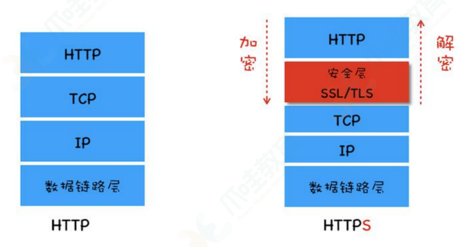
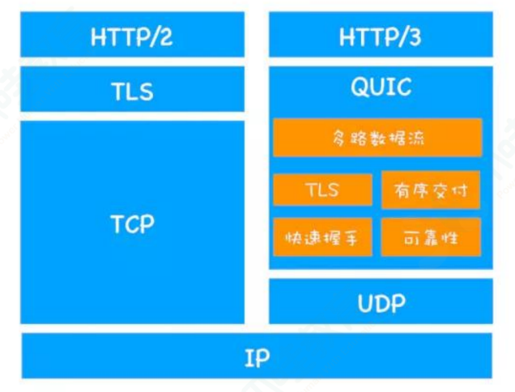

[TOC]

### 二、网络

#### 1 网络编程

网络编程的本质是多台计算机之间的数据交换。现在网络编程基本上都是基于请求/响应方式的，也就是一个设备发送请求数据给另一个，然后接收它的反馈。

网络编程中的两个主要问题：准确定位一台或多台主机；另一个就是找到主机后如何可靠高效的进行数据传输。

- TCP/IP协议中IP层主要负责网络主机的定位、确定数据传输的路由，IP地址可以唯一的确定网络中的一台主机。
- TCP层提供面向应用的可靠（TCP）或非可靠（UDP）的数据传输机制，这是网络编程的主要对象，一般不需要关心IP层是如何处理数据的
- 目前流行的网络编程模型是客户端-服务器结构。客户端在需要时向服务器提出申请，服务器作为守护进程始终运行，监听网络端口，一旦有客户端请求，就会启动一个服务进程来响应该客户

网络协议：在网络中要做到井井有条的交换数据，就必须遵守一些事先约定好的规则，如交换数据的格式、是否需要应答信息等，这些规则被称为网络协议。

为什么网络协议要分层：

- 简化难度和复杂度，各层之间独立，分割大问题为小问题
- 灵活性好，当其中一层的技术变化时，只要层间接口不变，其他层不受影响
- 易于实现和维护
- 促进标准化工作，分层后，每层功能可以相对简单的被描述

#### 2 网络体系结构/七层或四层网络模型

OSI七层模型：Open System Interconnect，开放式系统互联，特点：对等通信

> 为了使数据分组从源传送到目的地，源端 OSI 模型的每一层都必须与目的端的对等层进行通信，这种通信方式称为对等层通信。 在每一层通信过程中，使用本层自己协议进行通信。

- 应用层：网络服务与最终用户的一个接口，协议有：HTTP、HTTPS、POP3、FTP、DNS、SMTP
- 表示层：定义数据的格式、安全加密、压缩，格式有：JPEG、ASCII、加密格式等
- 会话层：控制应用程序的会话能力，协议有：HTTP、FTP、SMTP、POP3、DNS
- 传输层：最关键一层，负责整体的数据传输和数据控制，如端口号、流控和差错校验，对上三层提供可靠的传输服务，对网络层提供可靠的目的地信息，在这层数据的单位被称为数据段，协议有：TCP、UDP
- 网络层：负责逻辑地址寻址和路由选择，还要实现阻塞控制、网际互联等，协议有：IP、IPX、RIP、OSPF
- 链路层：物理层面的互联、节点通信，作用包括：物理地址寻址、数据的成帧等，数据单位为帧
- 物理层：负责0/1比特流，为上层协议提供传输数据的物理媒介，数据单位为比特

TCP/IP参考模型

- 应用层：定义数据格式，并按格式解读数据
- 传输层：定义端口，确认主机上应用程序的身份，并将数据包交给对应的应用程序
- 网络层：通过IP寻址来建立两个节点间的连接，进行MAC寻址
- 链路层：对0、1分组、定义数据帧，确认主机的物理地址，传输数据

#### 3 TCP和UDP

TCP：传输控制协议，一种面向连接的、可靠的、基于字节流的传输层通信协议，是专门为了在不可靠的网络中提供一个可靠的端对端字节流而设计的，面向字节流。

UDP：用户数据报协议，一种无连接的传输层协议，提供简单不可靠的非连接传输层服务，面向报文。适用于实时性高的情况，如游戏、直播。

区别：

- TCP面向连接，通信前要先建立连接，可靠性高；UDP不需要连接，可靠性低
- TCP需要三次握手，有延时，实时性差，过程复杂，也易于攻击；UDP实时性强，也销安全
- 在传输数据时，TCP报头比UDP复杂，实际包含的用户数据较少。TCP在IP协议基础上添加了序号机制、确认机制、超时重传机制等，保证了传输可靠性，不丢包不乱序，而UDP有丢包，所以TCP比UDP开销大
- TCP只能点对点传输，像打电话；UDP支持多对多通信，像广播
- TCP面向字节，数据包可分为几组传输；UDP面向报文，数据包只能一次发完

#### 4 TCP三次握手

目的：确保建立可靠连接；避免资源浪费。

建立一个TCP连接时，需要客户端和服务器总共发送3个包，主要作用是为了确认双方的接收能力和发送能力是否正常，指定自己的初始化序列号为后面的可靠性传送做准备。实质上就是连接服务器指定端口，建立TCP连接，并同步连接双方的序列号和确认号，交换TCP窗口大小信息。

刚开始客户端是closed状态，服务端是listen状态

1. 第一次，客户端向服务端发送连接请求报文。该报文段中包含自身的数据通讯初始序号ISN，此时，客户端处于 SYN-SENT 状态
2. 第二次，服务端收到连接请求报文段后，如果同意连接，则会发送一个应答，该应答中也会包含自身的数据通讯初始序号，发送完成后便进入 SYN-RECEIVED 状态
3. 第三次，当客户端收到连接同意的应答后，还要向服务端发送一个确认报文。客户端发完这个报文段后便进入 ESTABLISHED 状态，服务端收到这个应答后也进入 ESTABLISHED 状态，此时连接建立成功

#### 5 TCP四次挥手

TCP 使用四次挥手的原因是因为 TCP 的连接是全双工的，所以需要双方分别释放到对方的连接，单独一方的连接释放，只代表不能再向对方发送数据，连接处于的是半释放的状态。

最后一次挥手中，客户端会等待一段时间再关闭的原因，是为了防止发送给服务器的确认报文段丢失或者出错，从而导致服务器端不能正常关闭。

刚开始双方都处于 ESTABLISHED 状态，假如是客户端先发起关闭请求。四次挥手的过程如下：

1. 第一次，若客户端认为数据发送完成，则它需要向服务端发送连接释放请求。
2. 第二次，服务端收到连接释放请求后，会告诉应用层释放TCP链接。然后发送 ACK 包，并进入 CLOSE_WAIT 状态，此时表明客户端到服务端的连接已经释放，不再接收客户端发的数据了。但是因为 TCP 连接是双向的，所以服务端仍旧可以发送数据给客户端。
3. 第三次，服务端如果此时还有没发完的数据会继续发送，完毕后会向客户端发送连接释放请求，然后服务端便进入 LAST-ACK 状态
4. 第四次，客户端收到释放请求后，向服务端发送确认应答，此时客户端进入 TIME-WAIT 状态。该状态会持续 2MSL（最大段生存期，指报文段在网络中生存的时间，超时会被抛弃） 时间，若该时间段内没有服务端的重发请求的话，就进入 CLOSED 状态。当服务端收到确认应答后，也便进入 CLOSED 状态。

#### 6 DNS/域名解析，完整的查询过程

Domain Name Server，域名服务器，是进行域名和与之对应的IP地址转换的服务器。DNS中保存了域名与IP地址对应的表，以解析消息的域名。域名是网络中一台或一组计算机的名称，用于在传输数据时标识计算机的电子方位。

DNS是应用层协议，实际上是为其他应用层协议工作的，用于将用户提供的主机名解析为ip地址。

**过程**

1. 首先会在浏览器的缓存中查找对应的 IP 地址，如果查找到直接返回，若找不到继续下一步 
2. 将请求发送给本地 DNS 服务器，在本地域名服务器缓存中查询，如果查找到，就直接将查找结果返回，若找不到继续下一步 
3. 本地 DNS 服务器向根域名服务器发送请求，根域名服务器会返回一个所查询域的顶级域名服务器地址 
4. 本地 DNS 服务器向顶级域名服务器发送请求，接受请求的服务器查询自己的缓存，如果有记录，就返回查询结果，如果没有就返回相关的下一级的权威域名服务器的地址 
5. 本地 DNS 服务器向权威域名服务器发送请求，域名服务器返回对应的结果
6. 本地 DNS 服务器将返回结果保存在缓存中，便于下次使用本地 DNS 服务器将返回结果返回给浏览器

#### 7 URL和URI

URI是一个用于标识互联网资源名称的字符串。该种标识允许用户对网络中的资源通过特定的协议进行交互操作。

URI的最常见的形式是统一资源定位符（URL），经常指定为非正式的网址。

URL是URI的子集，URI属于URL更高层次的抽象，一种字符串文本标准。

#### 8 跨域

**概念**：当一个请求协议、域名、端口，任意一个与当前页面的url不同即为跨域。

**产生原因：**出于浏览器的同源策略，它是浏览器最核心、最基本的安全功能，不同源的客户端脚本在没有明确授权的情况下，不能读写其他域的资源。否则很容易受到XSS、CSRF等攻击。

**限制**：无法读取非同源网页的cookie、localStorage、DOM，无法发送ajax请求。除了img、link、script标签允许跨域。

**解决方案**：

- jsonp：它利用script标签没有跨域限制的漏洞，或以得到从其他来源动态产生的json数据。优点：兼容性好；缺点：只支持get方法，可能受到xss攻击。
- cors：需要服务端设置Access-Control-Allow-Origin，表示哪些域名可以访问资源
- postMessage：该方法允许来自不同源的脚本采用异步方式进行有限的通信，可实现跨文档、多窗口、跨域消息传递
- websocket：
- node中间件代理：同源策略是浏览器需要遵守的标准，但服务器之间不需要。代理服务器在接收到客户端请求后转发给目标服务器，拿到数据后再响应给客户端。vue本地开发就是这个意思。
- nginx反向代理：类似node中间件代码

#### 9 http和https的区别

http：最广泛的网络协议

https：以安全为目标的http通道，加入了TLS/SSL安全协议（TLS是SSL的最新版本），主要作用：一是建立信息安全通道，二是确认网站的真实性

区别：

- https需要ca证书，http 不需要
- http是超文本传输协议，信息是明文传输；https是具有安全性的ssl加密传输协议
- http使用80端口；https使用443端口
- http连接简单，无状态；https协议由 ssl+http 构建，可进行加密传输、身份认证的网络协议

#### 10 http状态码

**1XX系列**：指定客户端应相应的某些动作，代表请求已被接受，需要继续处理。由于 HTTP/1.0 协议中没有定义任何 1xx 状态码，所以除非在某些试验条件下，服务器禁止向此类客户端发送 1xx 响应。

**2XX系列**：代表请求已成功被服务器接收、理解、并接受。这系列中最常见的有200、201状态码。

**3XX系列**：代表需要客户端采取进一步的操作才能完成请求，这些状态码用来重定向，后续的请求地址（重定向目标）在本次响应的 Location 域中指明。这系列中最常见的有301、302状态码。

**4XX系列**：表示请求错误。代表了客户端看起来可能发生了错误，妨碍了服务器的处理。常见有：401、404状态码。

**5xx系列**：代表了服务器在处理请求的过程中有错误或者异常状态发生，也有可能是服务器意识到以当前的软硬件资源无法完成对请求的处理。常见有500、503状态码。

#### 什么是 https 协议

超文本传输安全协议（Hypertext Transfer Protocol Secure，简称： HTTPS）是一种通过计算机网络进行安全通信的传输协议。HTTPS 经由 HTTP 进行通信，利用 SSL/TLS 来加密数据包。HTTPS 的主要目的是提供对网站服务器的身份认证，保护交换数据的隐私与完整性。

HTTP 协议采用明文传输信息，存在信息窃听、信息篡改和信息劫持的风险，而协议 TLS/SSL 具有身份验证、信息加密和完整性校验的功能，可以避免此类问题发生。 

安全层的主要职责就是对发起的 HTTP 请求的数据进行加密操作和对接收到的 HTTP 的内容进行解密操作。

#### https 通信（握手）过程

1. 客户端向服务器发起请求，请求中包含使用的协议版本号、生成的一个随机数、以及客户端支持的加密方法。
2. 服务器端接收到请求后，确认双方使用的加密方法、并给出服务器的证书、以及一个服务器生成的随机数。 
3. 客户端确认服务器证书有效后，生成一个新的随机数，并使用数字证书中的公钥，加密这个随机数，然后发给服务器。并且还会提供 一个前面所有内容的 hash 的值，用来供服务器检验。 
4. 服务器使用自己的私钥，来解密客户端发送过来的随机数。并提供前面所有内容的 hash 值来供客户端检验。 
5. 客户端和服务器端根据约定的加密方法使用前面的三个随机数，生成对话秘钥，以后的对话过程都使用这个秘钥来加密信息。

#### 11 https加解密流程/ssl或tls过程

1. 客户端发起http请求
2. 服务端配置https数字证书，就是一对公钥和私钥
3. 服务端向客户端传送证书（公钥），包含颁发机构、过期时间等信息
4. 客户端解析证书，由TLS来验证证书，如果没问题就生成一个私钥，并用证书加密
5. 传送加密信息，让服务端得到这个加密后的私钥，后面的通信就可以用这个私钥进行加解密
6. 服务端用证书解密后得到私钥，然后把内容通过私钥进行对称加密
7. 返回加密后的信息
8. 客户端解密，客户端用私钥对信息进行解密

#### 12 http缓存

根据是否需要重新向服务器发起请求：

- 强制缓存：缓存数据未失效时，即max-age没有过期或者Expires的缓存时间没有过期，直接使用浏览器的缓存数据，不再向服务器发送任何请求。强制缓存生效时，状态码200。但这个过程中如果页面改变了，是获取不到的，需要强制刷新页面
- 协商缓存：当强制缓存不生效时，浏览器第二次请求就会与服务器进行协商，判断资源是否进行了更新。如果没修改，就返回304，浏览器继续使用缓存中的数据，如果有更新就返回更新后的资源，状态码200

根据是否可以被单个或多个用户使用：

- 私有缓存：浏览器级缓存，只能用于单独的用户，Cache-Control: Private
- 共享缓存：代理级缓存，可以被多个用户使用，Cache-Control: Public

#### 13 ajax

一种异步请求数据的web开发技术，在不刷新页面的情况下，通过异步请求加载后台数据，提高了用户体验，减少网络数据的传输量。

原理：相当于在用户和服务器间加了一个中间层（ajax引擎），使用户操作与服务器响应异步化。其核心是通过XMLHTTPRequest对象向服务器发送异步请求，从服务器获得数据，然后用js操作dom。

#### 14 get和post的区别

- 应用场景：get是幂等请求，不会对服务器资源产生影响，用于获取数据；post不是幂等请求，会对资源产生影响，用来提交数据
- 是否缓存：浏览器一般对get请求缓存，很少对post缓存，所以post更安全
- 传参：get请求的参数在url中，长度受浏览器和服务器限制，最长2k；post请求的参数可以在body中，支持多种数据类型，无限制
- 安全性：get是明文传输，post放在请求体中，通过抓包工具也可以获取

#### post 和 put 的区别

PUT 请求是向服务器端发送数据，从而修改数据的内容，但是不会增加数据的种类等，也就是说无论进行多少次 PUT 操作，其结果并没有不同。（可以理解为时更新数据） 

POST 请求是向服务器端发送数据，该请求会改变数据的种类等资源， 它会创建新的内容。（可以理解为是创建数据）

#### 常见的 http 请求头和响应头

**HTTP Request Header 常见的请求头： **

- Accept：浏览器能够处理的内容类型 
- Accept-Charset：浏览器能够显示的字符集 
- Accept-Encoding：浏览器能够处理的压缩编码 
- Accept-Language：浏览器当前设置的语言 
- Connection：浏览器与服务器之间连接的类型 
- Cookie：当前页面设置的任何 Cookie
- Host：发出请求的页面所在的域 
- Referer：发出请求的页面的 URL 
- User-Agent：浏览器的用户代理字符串 

**HTTP Responses Header 常见的响应头： **

- Date：表示消息发送的时间，时间的描述格式由 rfc822 定义 
- server:服务器名称 
- Connection：浏览器与服务器之间连接的类型 
- Cache-Control：控制 HTTP 缓存 
- content-type:表示后面的文档属于什么 MIME 类型
  - application/x-www-form-urlencoded：浏览器的原生 form 表单 ， 如果不设置enctype 属 性 ， 那么最终就会以 application/x-www-form-urlencoded 方式提交数据。该种方式提交的数据放在 body 里面，数据按照 key1=val1&key2=val2 的方式进行编码，key 和 val 都进行了 URL 转码。 
  - multipart/form-data：该种方式也是一个常见的 POST 提交方式，通常表单上传文件时使用该种方式。 
  - application/json：服务器消息主体是序列化后的 JSON 字符串。
  - text/xml：该种方式主要用来提交 XML 格式的数据。

#### HTTP 1.1 和 HTTP 2.0 的区别

- 二进制协议：
  - HTTP/2 是一个彻底的二进制协议，头信息和数据体都是二进制，并且统称为"帧"，可以分为头信息帧和数据帧。 帧的概念是它实现多路复用的基础。
  - 在 HTTP/1.1 版中，报文的头信息必须是文本（ASCII 编码），数据体可以是文本，也可以是二进制。 

- 多路复用：
  - HTTP/2 实现了多路复用，HTTP/2 仍然复用 TCP 连接，但是在一个连接里，客户端和服务器都可以同时发送多个请求或回应，而且不用按照顺序一一发送，这样就避免了"队头堵塞"的问题。 
- 数据流：
  - HTTP/2 使用了数据流的概念，因为 HTTP/2 的数据包是不按顺序发送的，同一个连接里面连续的数据包，可能属于不同的请求。因此，必须要对数据包做标记，指出它属于哪个请求。HTTP/2 将每个请求或回应的所有数据包，称为一个数据流。每个数据流都有一个独一无二的编号。数据包发送时，都必须标记数据流 ID ，用来区分它属于哪个数据流。
- 头信息压缩：HTTP/2 实现了头信息压缩，由于 HTTP 1.1 协议不带状态，每次请求都必须附上所有信息。所以，请求的很多字段都是重复的，比如 Cookie 和 User Agent ，一模一样的内容，每次请求都必须附带，这会浪费很多带宽，也影响速度。HTTP/2 对这一点做了优化，引入了头信息压缩机制。一方面，头信息使用 gzip 或 compress 压缩后再发送；另一方面，客户端和服务器同时维护一张头信息表，所有字段都会存入这个表，生成一个索引号，以后就不发送同样字段了，只发送索引号，这样就能提高速度了。 
- 服务器推送：HTTP/2 允许服务器未经请求，主动向客户端发送资源，这叫做服务器推送。使用服务器推送提前给客户端推送必要的资源，这样就可以相对减少一些延迟时间。这里需要注意的是 http2 下服务器主动推送的是静态资源，和 WebSocket 以及使用 SSE 等方式向客户端发送即时数据的推送是不同的。

#### http2 的头部压缩算法是怎样的

HTTP2 的头部压缩是 HPACK 算法。在客户端和服务器两端建立“字典”，用索引号表示重复的字符串，采用哈夫曼编码来压缩整数和字符串，可以达到 50%~90%的高压缩率。

具体来说: 

在客户端和服务器端使用“首部表”来跟踪和存储之前发送的键值对，对于相同的数据，不再通过每次请求和响应发送； 

首部表在 HTTP/2 的连接存续期内始终存在，由客户端和服务器共同渐进地更新； 

每个新的首部键值对要么被追加到当前表的末尾，要么替换表中之前的值。

#### http 3.0 

HTTP/3 基于 UDP 协议实现了类似于 TCP 的多路复用数据流、传输可靠性等功能，这套功能被称为 QUIC 协议。

1. 流量控制、传输可靠性功能：QUIC 在 UDP 的基础上增加了一层来保证数据传输可靠性，它提供了数据包重传、拥塞控制、以及其他一些 TCP 中的特性。 
2. 集成 TLS 加密功能：目前 QUIC 使用 TLS1.3，减少了握手所花费的RTT 数。 
3. 多路复用：同一物理连接上可以有多个独立的逻辑数据流，实现了数据流的单独传输，解决了 TCP 的队头阻塞问题。
4. 快速握手：由于基于 UDP，可以实现使用 0 ~ 1 个 RTT 来建立连接。

#### 15 前端安全问题

1. XSS跨站脚本攻击：
   - 定义：通过html标签或js注入恶意脚本，网站又没有对恶意代码进行过滤，导致恶意代码执行。
   - 危害：骗取个人信息，窃取cookie等数据，破坏页面结构；DOS攻击；流量劫持
   - 防御：CSP白名单；转义字符；cookie使用http-only；关键操作使用验证码
2. CSRF跨站请求伪造：
   - 定义：诱导用户进入第三方网站，利用用户已登录的身份，绕过后台的用户验证，以用户的名义进行非法操作
   - 原理：利用cookie会在同源请求中携带发送的特点
   - 防御：cookie设置SameSite属性，限制被第三方使用；请求头中origin或referer判断请求是否为允许访问的站点；增加token；敏感操作强制使用验证码。
3. 点击劫持：
   - 定义：一种视觉欺骗的攻击手段，将需要攻击的网站通过iframe的方式嵌入自己的网页中，并设置为透明，在页面中放置一个按钮诱导用户点击。
   - 防御：X-FRAME-OPTIONS响应头设置如何通过iframe方式展示；js判断为iframe时，进行处理。
4. URL中转漏洞：
   - 定义：借助未验证的URL跳转，将应用程序引导到不安全的第三方网站
   - 原理：构建恶意链接并伪装，诱导用户点击，服务器或浏览器解析后中转到恶意网站
   - 防御：referer的限制；网站自己生成链接时加入有效性验证token
5. SQL注入：
   - 定义：一种常见的Web安全漏洞，数据与代码未分离，开发者直接拿用户输入的数据拼接sql语句
   - 防御：限制对数据库的操作权限；严格的参数校验；入库的特殊字符转义；
6. OS命令注入：
   - 定义：与SQL注入类似，只不过攻击针对操作系统
   - 防御：对前端提交的内容校验；调用系统命令前进行参数转义过滤；不直接拼接命令语句
7. CDN劫持：
   - 定义：对CDN进行劫持或对CDN中的资源进行污染
   - 防御：现在的CDN都支持了新属性integrity，对资源进行完整性校验

#### 16 XSS攻击

XSS是跨站脚本攻击，一种代码注入攻击。攻击者通过在网站注入脚本，从而盗取用户的信息，如cookie等。

本质上是因为网站没有对恶意代码进行过滤，与正常代码混合在一起，浏览器无法分辨哪些脚本可信，从而导致恶意代码的执行。

可以通过这种攻击实现以下操作：

- 获取页面数据，如dom、cookie、localStorage
- dos攻击：发送合理请求，占用服务器资源，使用户无法访问服务器
- 破坏页面结构
- 流量劫持，将链接指向其他网站

攻击类型：

- 存储型：恶意脚本存储在目标服务器上，当浏览器请求数据时，脚本被加载并执行
- 反射型：攻击者诱导用户访问带有恶意代码的URL后，服务端接收数据后处理，然后把带有恶意代码的数据发送到浏览器端，浏览器解析这段带有XSS代码的数据后当做脚本执行
- DOM型：修改页面的dom节点

如何防御：

- 对需要插入到HTML中的代码做好转义
- 使用CSP，建立一个白名单，告诉浏览器哪些外部资源可以加载和执行，如果拦截由浏览器实现。开启方式，一种是设置 HTTP 首部中的 Content-Security-Policy，一种是设置 meta 标签的方式
- 对敏感信息的保护，如cookie使用http-only，使用验证码

#### 17 CSRF攻击

CSRF 攻击指跨站请求伪造攻击，攻击者诱导用户进入第三方网站，然后该网站向被攻击网站发送跨站请求。如果用户在被攻击网站中保存了登录状态，那么攻击者就可以利用这个登录状态，绕过后台的用户验证，冒充用户向服务器执行一些操作。

CSRF 攻击的本质是利用 cookie 会在同源请求中携带发送给服务器的特点，以此来实现用户的冒充。

攻击类型：

- GET类型：比如在网站的img标签里构建一个请求，打开网站时自动发起提交
- POST类型：构建一个表单，然后隐藏它，用户进入页面时自动提交这个表单
- 链接类型：在a标签的href属性里构建一个请求，诱导用户点击

如何防御：

- 进行同源检测：服务器根据请求头中origin或referer（字段会告诉服务器该网页从哪个页面链接过来的）来判断请求是否为允许访问的站点
- 使用CSRF Token验证：请求参数中加入服务端返回的token，服务端对此进行验证
- 对cookie进行双重验证：
- 设置cookie属性时设置Samesite，限制cookie不能被第三方使用

#### 18 网络劫持有哪几种，如何防范

DNS劫持：输入网址并未跳转到指定网站，而是跳转到了其他网站。DNS 强制解析：通过修改运营商的本地 DNS 记录，引导用户流量到缓存服务器。违法行为，现在很少。

HTTP劫持：网站是一直有广告。这是由于http明文传输，响应内容被修改。使用https，响应内容加密，无法劫持响应内容。

#### 有哪些可能引起前端安全的问题？

跨站脚本攻击（Cross-Site Scripting，XSS）：⼀种代码注⼊⽅式, 为了与 CSS 区分所以被称作 XSS。早期常⻅于⽹络论坛, 起因是⽹站没有对⽤户的输⼊进⾏严格的限制, 使得攻击者可以将脚本上传到帖⼦让其他⼈浏览到有恶意脚本的⻚⾯, 其注⼊⽅式很简单包括但不限于 JavaScript / CSS / Flash 等；

iframe 的滥⽤: iframe 中的内容是由第三⽅来提供的，默认情况下他们不受控制，他们可以在 iframe 中运⾏JavaScirpt 脚本、Flash 插件、弹出对话框等等，这可能会破坏前端⽤户体验； 

跨站点请求伪造（Cross-Site Request Forgeries，CSRF）: 指攻击者通过设置好的陷阱，强制对已完成认证的⽤户进⾏⾮预期的个⼈信 息或设定信息等某些状态更新，属于被动攻击

恶意第三⽅库: ⽆论是后端服务器应⽤还是前端应⽤开发，绝⼤多数时候都是在借助开发框架和各种类库进⾏快速开发，⼀旦第三⽅库被植⼊恶意代码很容易引起安全问题。

#### 19 webSocket

是html5规范提出的一种应用层协议，基于TCP，复用HTTP的握手通道，只需要一次握手，就直接可以创建持久性的连接，并进行双向数据传输。

#### 20 restful

一种架构设计风格，通过使用事先定义好的接口与不同的服务联系起来，使用post、delete、put、get请求方式对指定的URL资源进行操作。因此，restful是通过URI实现对资源的管理及访问，具有扩展性强、结构清晰的特点。

特点：

- 每个URL代表一种资源
- 使用GET（获取）、POST（新建/更新）、PUT（更新）、DELETE（删除） 4个表示操作方式的动词对服务端资源进行操作
- 通过操作资源的表现形式来操作资源
- 资源的表现形式是XML或HTML
- 客户端与服务端之间的交互在请求之间是无状态的，每个请求都必须包含理解请求所必需的信息